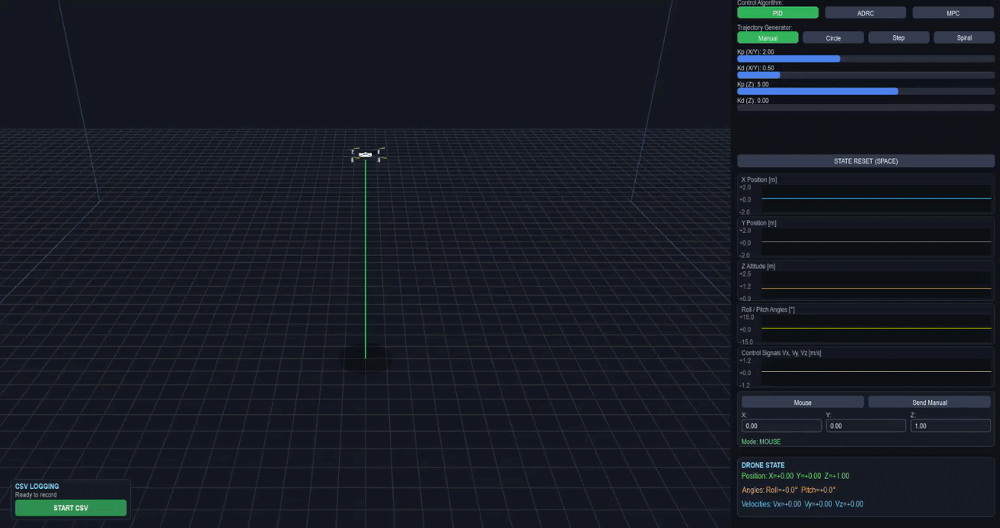
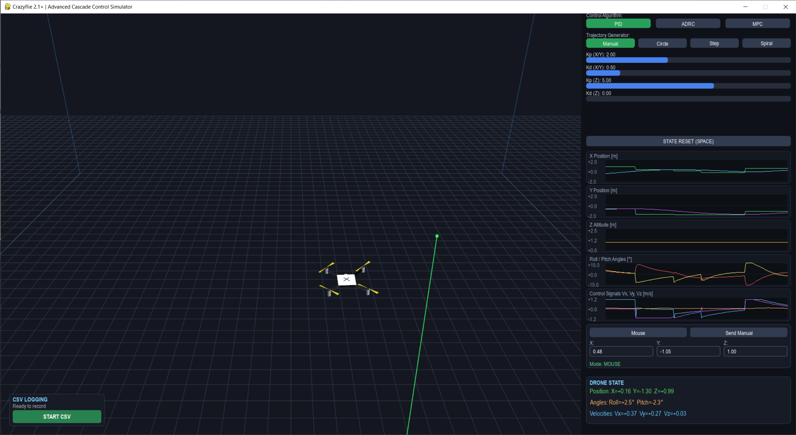

# Crazyflie 3D - Control Algorithms Simulator


An advanced 3D flight simulator for the **Crazyflie 2.1+** drone, built in Python using Pygame and OpenGL. The project utilizes a **simplified dynamics model** (where position is regulated by velocity control) to allow real-time testing, tuning, and comparison of various cascade control algorithms with full 3D visualization and telemetry charts.

---

## Demo

<p align="center">
  <br><br>
  
</p>

---


## Key Features

* **Multiple Control Algorithms**:
  * **PID** (Proportional-Integral-Derivative) – Classic, proven controller.
  * **ADRC** (Active Disturbance Rejection Control) – Active disturbance rejection using an Extended State Observer (ESO).
  * **MPC** (Model Predictive Control) – Horizon-based predictive control.
* **3D Visualizations**: Real-time smooth 3D environment view with mouse support for setting target setpoints.
* **Trajectory Generator**: Manual modes, circle flight, step response, and spiral.
* **Online Charts**: Real-time monitoring of position (X, Y, Z), angles (Roll, Pitch), and control signals.
* **Logging Panel**: Built-in tool for tracking errors and system states.

---

## System Requirements

* Python 3.8+
* Graphics card supporting OpenGL

---

## Installation

1. Clone the repository or download the project files.
2. Install the required libraries by running:
   ```bash
   pip install -r requirements.txt
   ```

---

## Running the Simulator

To run the simulator, execute the main launcher script in your terminal:
```bash
python main.py
```

---

## Controls and Usage

* **Spacebar**: Resets the drone state and simulation parameters to default values.
* **Mouse (in 3D view)**: Left-clicking on the plane allows you to directly set the target position (Setpoint) for the drone.
* **Side Panel**: Allows you to switch control algorithms, tune sliders (e.g., Kp, Kd, wc, wo, N), and select trajectories.

---

## Project Structure

* **main.py** – Lightweight entry point / launcher script.
* **app.py** – Core application logic, event loop, and module integration hub.
* **config.py** – Global settings and constants (resolutions, parameters).
* **controllers.py** – Implementation of control algorithms (PID, ADRC, MPC).
* **drone.py** – Simplified physical and kinematic model of the Crazyflie 3D drone.
* **trajectory.py** – Flight trajectory generator.
* **ui.py** – Graphical user interface elements (buttons, sliders, charts, panels).
* **camera.py** – Camera handling and OpenGL projections.
* **renderer.py** – Functions rendering the 3D scene and 2D interface.
* **logger.py** – Data logger and telemetry.

---

## Author

Created by Ignacy Glrua.

---

## License

This project is licensed under the MIT License. See the LICENSE file for details.